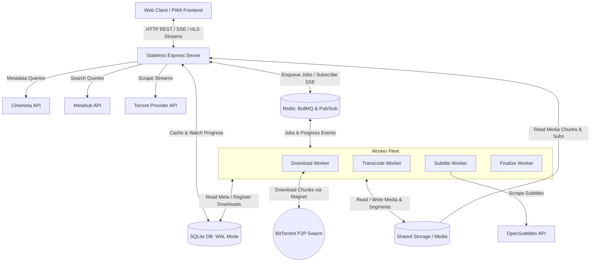
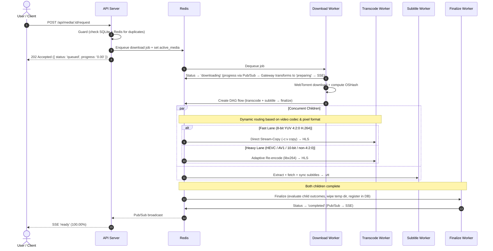
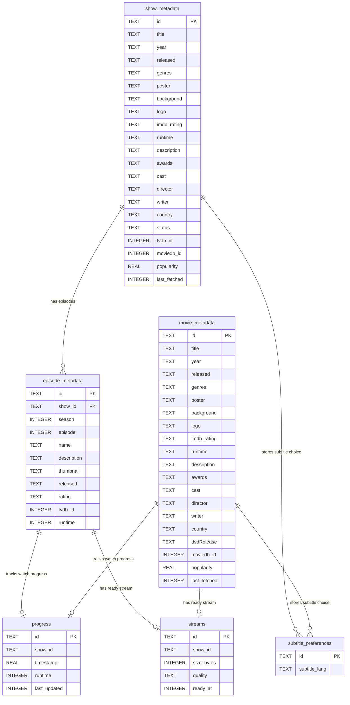

# Orion System Architecture & Data Flow

Orion is a media streaming server and PWA that scrapes metadata, downloads torrent streams via WebTorrent, transcodes to HLS via FFmpeg, synchronizes subtitles via OpenSubtitles and `ffsubsync`, and streams to any device.

---

## 1. System Architecture



### Core Components

1. **Frontend PWA (`src/renderer/`):** Vanilla JS SPA built with Vite. Uses `Hls.js` for playback, a centralized reactive store (`Store.js`) with normalized domain caches, and SSE (`/events`) for real-time backend sync.

2. **Stateless API Server (`src/main/server.ts`)**: Express server that serves the PWA, exposes REST endpoints (`routes/api.ts`) and HLS stream routes (`routes/stream.ts`), proxies external metadata APIs, and enqueues jobs into BullMQ. Checks Redis `orion:active_media:<fileId>` for O(1) duplicate prevention before enqueuing. Subscribes to Redis Pub/Sub (`orion:events`) and relays events to connected SSE clients.

3. **Redis**: Three roles:
   * **Active Media State** (`orion:active_media:<fileId>`): Source of truth for in-flight media. Synced on all status transitions, cleaned up on completion/failure (2-hour safety TTL).
   * **BullMQ Queues & FlowProducer**: Job queues (`download`, `transcode-fast`, `transcode-heavy`, `subtitle`, `finalize`) with typed payloads (`src/main/types/jobs.ts`). After download completes, a DAG flow is created: `finalize` as parent, `subtitle` and dynamic transcode lane (`transcode-fast` or `transcode-heavy`) as concurrent children.
   * **Workers**:
     * **Download Worker**: `WebTorrent`-based multi-source downloader with speed testing, stall detection, and automatic eviction.
     * **Transcode Workers (Dual Lane Isolation)**:
       * **Fast Lane (`transcode-fast`)**: Standard 8-bit YUV 4:2:0 H.264 video uses direct stream-copy (`-c:v copy`) + AAC audio transcoding. Runs in dedicated fast queue with zero CPU contention.
       * **Heavy Lane (`transcode-heavy`)**: HEVC (H.265), 10-bit HDR, AV1, and non-4:2:0 video profiles adaptively re-encode to universal 8-bit H.264 via `libx264` (`preset veryfast`, `crf 22`, bounded CPU threads).
     * **Subtitle Worker**: Extracts embedded `.vtt` tracks, fetches OpenSubtitles / SubDL subtitles, and aligns audio via `ffsubsync` using cached `.npz` speech representations.
     * **Finalize Worker**: Terminal evaluator of the media pipeline. Evaluates transcode and subtitle child job outcomes, computes media directory size, registers download in SQLite, safely cleans up temporary sandbox files, and broadcasts `COMPLETED`.

5. **Storage:**
   * **SQLite (`~/.orion/orion.db`)**: WAL mode. Stores metadata cache, episode records, watch progress, subtitle preferences, and stream records.
   * **Media Library (`~/.orion/streams/`)**: HLS streams (`hls/`) and WebVTT subtitles (`subtitles/`).
   * **Temporary Storage (`~/.orion/temp/`)**: Isolated job sandboxes (`movies/<fileId>/`, `shows/<fileId>/`) purged upon job completion or failover.

### Conventions

* **Canonical File IDs**: `{imdbId}` for movies, `{imdbId}_s{season}_e{episode}` for episodes.
* **API Envelope**: All catalog/detail endpoints return `{ metadata, progress, ready }`.
* **Type Contracts** (`src/main/types/`): Shared domain entities, job DTOs, and event types enforced at compile time across the API and all workers.

---

## 2. Data Flows

### A. Metadata Flow

1. **Catalog** (`GET /api/movies|shows`): Proxies Cinemeta, decorates in-memory with local watch progress, returns directly (no DB writes).
2. **Details** (`GET /api/movies|shows/:id`): Checks SQLite cache:
   * **Hit**: Returns immediately (continuing shows expire after 24h).
   * **Miss**: Fetches from Cinemeta, caches in SQLite, returns.

### B. Download & Processing Pipeline



#### Pipeline Safety & Processing Policies

* **Stream Discovery & Download**:
  * **Tournament Discovery**: Probes candidates sequentially; first to hit 100 KB/s locks in, otherwise fastest wins.
  * **Dead Stream Failover**: 0 new bytes for 20 min (or torrent error) → wipes candidate temp directory and triggers a fresh tournament across remaining unfailed candidates at elevated `HIGH` priority; all exhausted → job failed.
  * **Stall Rescheduling**: <100 KB/s for 30s → yields to fresh (`NORMAL`) or recovering (`HIGH`) queue items by demoting to `LOW` priority, preserving downloaded pieces.
  * **Progress Throttling**: Polls metrics every 2s, broadcasts only on integer percentage change.

* **Transcoding (Two-Lane Pipeline)**:
  * **Dual Lane Isolation**: Routes standard 8-bit YUV 4:2:0 H.264 to `transcode-fast` (I/O bound) and HEVC/AV1/10-bit/non-4:2:0 profiles to `transcode-heavy`, preventing head-of-line blocking.
  * **Universal Audio Sync**: Downmixes multi-channel audio to stereo AAC with `-af aresample=async=1:first_pts=0` to guarantee zero timestamp drift and pad initial audio silence from PTS 0 across HLS segments.
  * **Failure Partial Cleanup**: Wipes partial HLS directory (`dirs.hlsDir`) immediately on transcode failure, reclaiming disk space consumed by partial segments.

* **Finalization & Storage (DAG Terminal Evaluator)**:
  * **DAG Evaluator**: Runs as the terminal step of the media flow (`ignoreDependencyOnFailure: true`). Evaluates child job completion (`transcode` and `subtitle`):
    * **Transcode (Mandatory)**: If transcode failed, purges `dirs.baseDir` (both partial HLS chunks and subtitles), publishes `MEDIA_REQUEST_STATUS.FAILED`, and fails the job.
    * **Subtitles (Best-Effort)**: If subtitles failed while transcode succeeded, purges only partial `.vtt` files from `dirs.subtitlesDir` and proceeds to register the playable media in SQLite as `MEDIA_REQUEST_STATUS.READY`.
    * **Raw Temp Wipe**: Under all finalizer outcomes, recursively wipes the entire isolated temporary directory (`rawTempDir`) via `cleanupJobTempDir()`, eliminating ghost disk leaks.
  * **LRU Disk Eviction**: Enforces storage cap (default 100 GB), evicts least recently watched media first.

### C. Playback Flow

1. `GET /api/media/:id/stream`: API validates HLS playlist exists, returns stream URL and synced subtitle tracks in a single call.
2. Client loads `.m3u8` via `Hls.js`, streams `.ts` segments over HTTP.
3. Client sends periodic watch progress to `POST /api/media/:id/progress`.

---

## 3. API Reference

All catalog/detail responses use the `{ metadata, progress, ready }` envelope.

| Endpoint | Method | Params / Body | Description |
|:---|:---|:---|:---|
| `/api/movies` | `GET` | `?limit=50` | Popular movies catalog |
| `/api/shows` | `GET` | `?limit=50` | Popular shows catalog |
| `/api/movies/:id` | `GET` | IMDb ID | Movie details, progress, ready status |
| `/api/shows/:id` | `GET` | IMDb ID | Show details, episodes, progress, ready status |
| `/api/search` | `GET` | `?q=query` | Search Metahub catalog |
| `/api/continue-watching` | `GET` | `?limit=20&type=movie\|show` | Continue watching records |
| `/api/queue` | `GET` | - | All in-flight media requests from Redis |
| `/api/media/:id/request` | `POST` | - | Enqueue media request |
| `/api/media/:id/stream` | `GET` | Canonical file ID | Resolve HLS stream URL and subtitles |
| `/api/media/:id/progress` | `POST` | `{ timestamp, runtime }` | Save playback progress |
| `/api/media/:id/subtitles/preference` | `GET` | Canonical file ID | Saved subtitle language preference |
| `/api/media/:id/subtitles/preference` | `POST` | `{ subtitle_lang }` | Upsert subtitle language preference |
| `/events` | `GET` | - | SSE real-time event stream (15s heartbeat) |
| `/stream/hls/:id/:filename` | `GET` | File ID, `.m3u8`/`.ts` | HLS playlist and segment serving |
| `/stream/subtitles/:id/:filename` | `GET` | File ID, `.vtt` | WebVTT subtitle serving |

### SSE Event Payload

```json
{
  "id": "tt123456_s1_e1",
  "status": "queued | preparing | ready | failed | removed",
  "progress": "0.00 - 100.00"
}
```

Workers publish to Redis Pub/Sub channel `orion:events` → API server fans out to all connected SSE clients.

---

## 4. Database Schema

`~/.orion/orion.db`. SQLite with `PRAGMA journal_mode = WAL` and foreign keys enabled.



---

## 5. Caching & Eviction

### Backend Caching
* **Metadata**: Cached in SQLite on detail view or download. Continuing shows expire after 24h; movies never expire. Catalog listings and search results are not cached.
* **Torrent URLs**: In-memory map (`torrentStreamsCache`), 1-hour TTL.
* **PWA Assets**: Service worker precaching via `vite-plugin-pwa`.

### LRU Storage Eviction
When a new download would exceed the storage cap (default 100 GB, configurable via `MAX_STORAGE_GB`), the `EvictionManager` evicts media in LRU order by `last_updated` watch timestamp (falling back to `downloadTime` for unwatched items), deleting HLS directories + subtitles from disk and purging DB entries. Broadcasts `REMOVED` status over SSE.

### Client-Side Store (`Store.js`)
Centralized reactive pub-sub store with normalized caches:

```javascript
this.state = {
  currentPage: 'movies',
  metadata: {},                 // Indexed by IMDb ID (_isFull flag prevents redundant fetches)
  progress: {},                 // Keyed by movieId or episodeId
  ready: {},                    // Keyed by movieId or episodeId
  activeMediaRequests: {},      // Maps fileId -> { fileId, status, progress }
  popularMovies: null,          // string[] of IMDb IDs
  popularShows: null,           // string[] of IMDb IDs
  continueWatchingMovies: null, // Array of { id, last_updated }
  continueWatchingShows: null,  // Array of { id, episodeId, last_updated }
};
```

Metadata, progress, and ready states are kept in separate caches. The UI stitches them together at render time.
